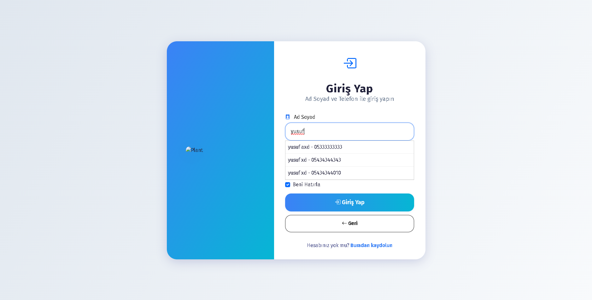
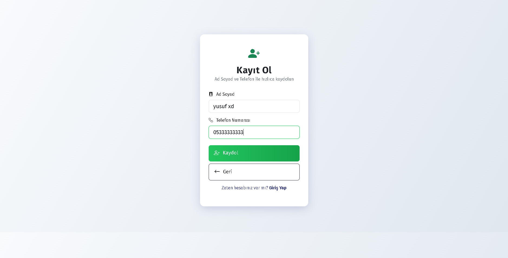
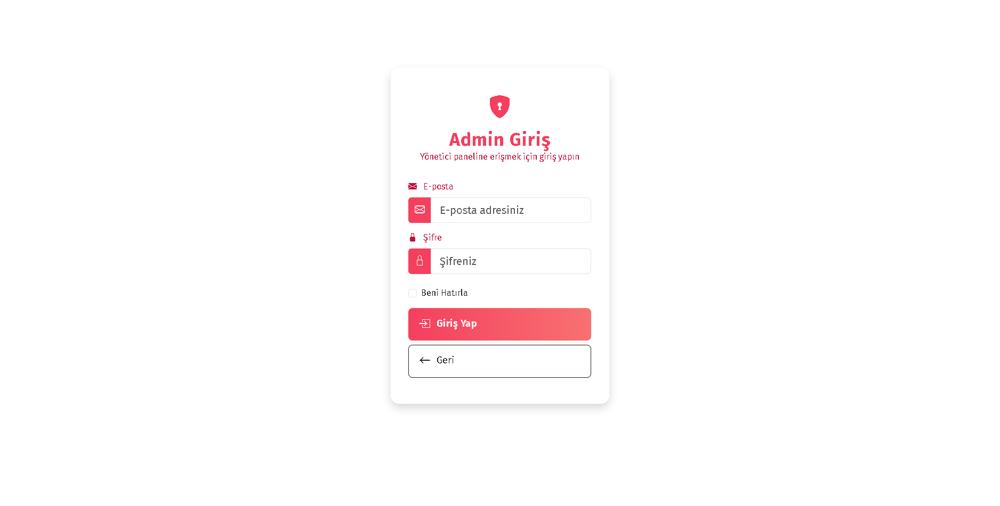
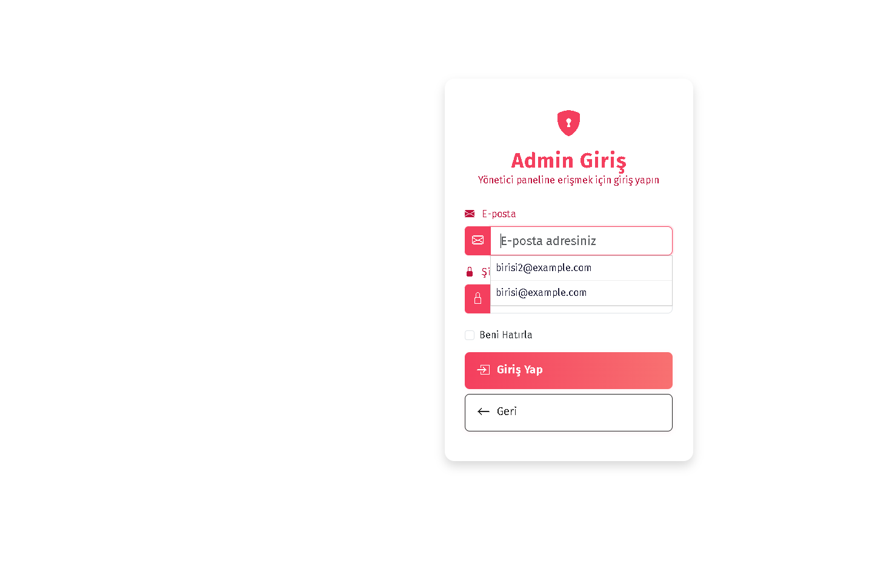

# Randevu Sistemi

Bu proje, Randevuyla çalışan işletmeler için geliştirilmiş, kullanıcıların online randevu almasını ve yönetmesini sağlayan bir web uygulamasıdır.

## Kullanılan Teknolojiler

- **PHP** – Sunucu tarafı programlama dili
- **MySQL** – Veritabanı yönetim sistemi
- **HTML** – Web sayfası iskeleti
- **CSS** – Sayfa tasarımı ve stil
- **JavaScript** – Dinamik işlemler ve etkileşimler
- **Bootstrap Icons** – Arayüz ikonları

## Ekran Görüntüleri

### Giriş Sayfası

### Kayıt Ol Sayfası

### Admin Giriş Paneli

## Özellikler

### Kullanıcılar için
- Hesap oluşturma ve giriş yapma
- Randevu oluşturma, görüntüleme ve iptal etme
- Randevu geçmişini görüntüleme
- Profil bilgilerini güncelleme _(planlanıyor)_
- Şifre sıfırlama _(planlanıyor)_
- Randevu hatırlatma bildirimi _(planlanıyor)_
- Randevu tekrar etme _(planlanıyor)_

### Personel/Yönetici için
- Randevu taleplerini onaylama veya reddetme
- Randevu güncelleme ve iptal etme
- Çalışma saatleri ve tatil günleri yönetimi
- Müşteri listesi ve geçmişi
- Raporlama ve istatistikler _(planlanıyor)_

### Genel
- Çoklu dil desteği (TR/EN)
- Mobil uyumlu arayüz (responsive)
- Yorum ve değerlendirme _(planlanıyor)_
- Bildirim paneli _(planlanıyor)_

## Gereksinimler

- XAMPP (önerilen) veya benzeri bir web geliştirme platformu

## Kurulum

1. Bu depoyu XAMPP dosyalarının içindeki `htdocs` dizinine klonlayın:
2. XAMPP platformundan *Apache Web Server* ve *MySQL Database*'i çalıştırın.
3. *sqlDatabase.sql* dosyasındaki MySQL sorgusunu kopyalayın.
4. Tarayıcınızda `localhost/phpmyadmin` adresine gidin.
5. Üst menüdeki `📃SQL` kısmına kopyaladığınız MySQL sorgusunu yapıştırın ve kodu çalıştırın.

## Kullanım

1. Çalışır halde değilse XAMPP platformundan *Apache Web Server* ve *MySQL Database*'i çalıştırın.
2. Tarayıcınızda `localhost/randevu-sistemi/` adresine gidin.
3. Kayıtlı bir kullanıcı olarak giriş yapın veya yeni bir hesap oluşturun.
4. Randevu oluşturmak için uygun bir tarih ve saat seçin ve randevu alın.
5. Kuaför salonu personeli (admin), giriş yaptıktan sonra randevu taleplerini görüntüleyebilir ve güncelleme/iptal etme seçeneklerini kullanabilir.
6. Kullanıcılar, randevularını görüntüleyebilir ve gerektiğinde güncelleme/iptal işlemlerini gerçekleştirebilir.

## İletişim

Eğer herhangi bir sorunuz, öneriniz veya geri bildiriminiz varsa, lütfen iletişime geçmekten çekinmeyin. İletişim bilgilerini aşağıda bulabilirsiniz:

- [LinkedIn](http://www.linkedin.com/in/yusuf-burkuk-390b4027a)
- [E-posta](mailto:yusufbrkk12@gmail.com)[yusufbrkk12@gmail.com]

## Katkı

Katkıda bulunmak isterseniz, lütfen bir pull request gönderin veya issue açın.

